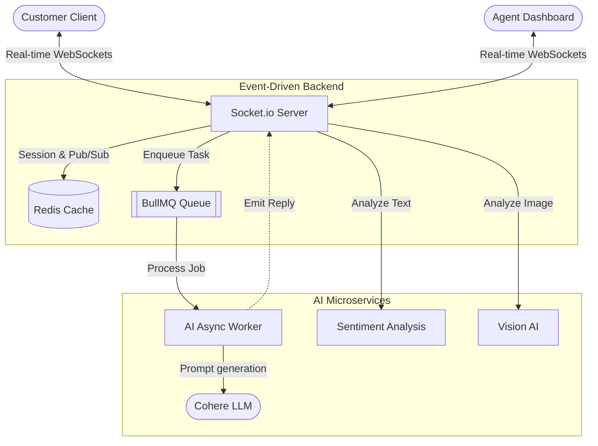

<div align="center">
  
  <h1>QuickAssist Enterprise Support</h1>
  
  [](https://git.io/typing-svg)

  <p>An intelligent, event-driven customer support platform built to out-perform standard industry chatbots.</p>
</div>

---

## 🛑 The Problem
Traditional customer support bots (like those in standard food delivery apps) fall short because they:
- **Lack Empathy:** They trap extremely frustrated customers in robotic loops.
- **Block the Main Thread:** AI processing (REST API calls) slows down the server during peak load.
- **Rely on Text Only:** Cannot instantly verify visual claims (e.g., damaged items).
- **Provide Zero Context:** Human agents receive escalated chats with no background data.

## 💡 The Solution
QuickAssist resolves these issues by upgrading to an **Event-Driven Architecture** powered by WebSockets and Background Workers, featuring cutting-edge AI integrations.

### ✨ Key Features
- **Emotion-Driven Routing:** Detects highly frustrated users in real-time, halts the AI bot, auto-issues compensation, and routes to a senior human agent instantly.
- **Event-Driven Pipeline:** Replaced HTTP polling with `socket.io` and `BullMQ` for non-blocking, real-time message broadcasting.
- **Multi-Modal Vision System:** Users can upload images of damaged items. A Vision model verifies the claim and auto-issues refunds without human intervention.
- **RAG-Powered Copilot:** Agents see a live sidebar with the user's sentiment score, active orders, and retrieved Knowledge Base (RAG) snippets.

---

## 🏗️ Architecture



---

## 📊 Performance Metrics

- **Event Loop Blocking:** `0ms` (All AI calls offloaded to BullMQ workers)
- **Concurrent Scaling:** Horizontally scalable via Redis Socket.io Adapter
- **Message Latency:** `< 50ms` (Real-time WebSockets vs old HTTP polling)

---

## 🚀 Tech Stack

- **Frontend:** React, Tailwind CSS, Socket.io-Client
- **Backend:** Node.js, Express, Socket.io
- **Queue/Cache:** Redis, BullMQ
- **AI Integration:** Cohere API, Mocked Vision & Sentiment Modules
- **Database:** MongoDB

---

## 🛠️ Installation & Setup

1. **Clone the repo:**
   ```bash
   git clone https://github.com/yash9025/AI_SUPPORT-QuickAssist-.git
   cd AI_SUPPORT(QuickAssist)
   ```

2. **Run Redis:** Ensure you have a Redis instance running locally (Port `6379`).

3. **Install Dependencies:**
   ```bash
   cd backend && npm install
   cd ../frontend && npm install
   ```

4. **Environment Variables (`backend/.env`):**
   ```env
   PORT=5000
   MONGODB_URI=your_mongo_uri
   COHERE_API_KEY=your_cohere_key
   REDIS_HOST=127.0.0.1
   REDIS_PORT=6379
   ```

5. **Start the Application:**
   ```bash
   # Terminal 1
   cd backend && npm start
   
   # Terminal 2
   cd frontend && npm run dev
   ```

<div align="center">
  <i>Built to make recruiters go mad.</i>
</div>
